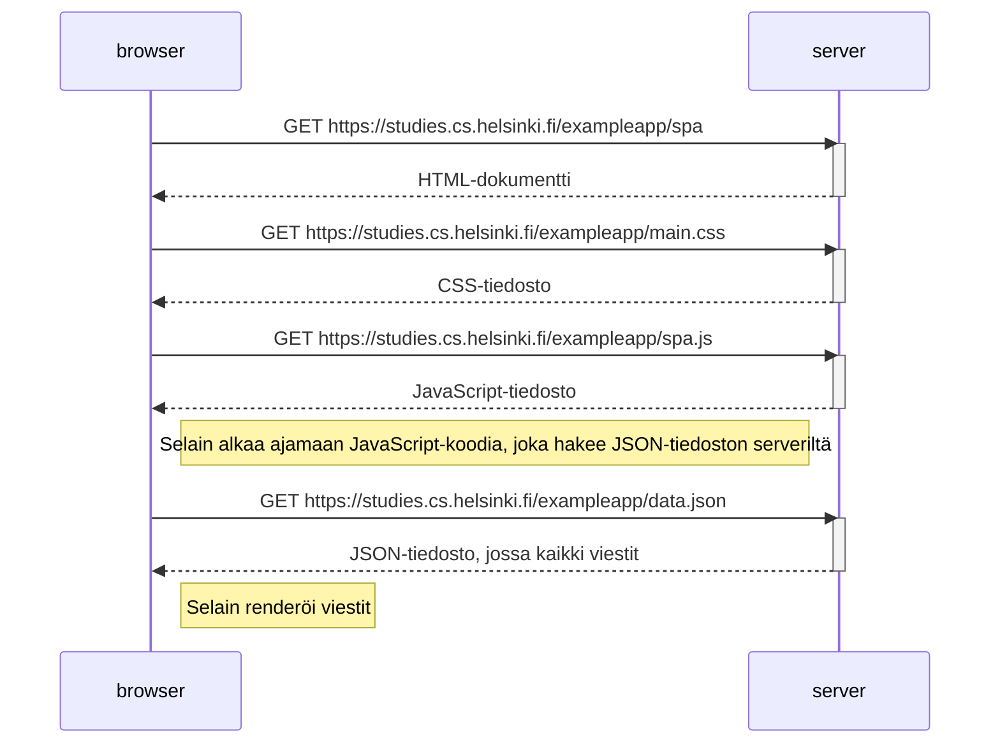

```mermaid
sequenceDiagram
    participant browser
    participant server
    
    browser->>server: GET https://studies.cs.helsinki.fi/exampleapp/spa
    activate server
    server-->>browser: HTML-dokumentti
    deactivate server
    
    browser->>server: GET https://studies.cs.helsinki.fi/exampleapp/main.css
    activate server
    server-->>browser: CSS-tiedosto
    deactivate server

    browser->>server: GET https://studies.cs.helsinki.fi/exampleapp/spa.js
    activate server
    server-->>browser: JavaScript-tiedosto
    deactivate server
    
    Note right of browser: Selain alkaa ajamaan JavaScript-koodia, joka hakee JSON-tiedoston serveriltä
    
    browser->>server: GET https://studies.cs.helsinki.fi/exampleapp/data.json
    activate server
    server-->>browser: JSON-tiedosto, jossa kaikki viestit
    deactivate server    

    Note right of browser: Selain renderöi viestit
```
